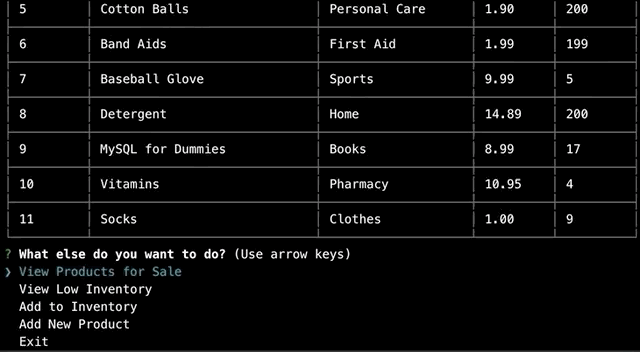

# bAmazon
A store inventory node app. This is command line application takes in user input from the choices provided, customer or manager. If the user selects 'Customer' the app will provide a list of products available for purchase and will again ask for user input on what the user want to purchase. User can purchase multiple items before getting a total amount to pay. If the user selects 'Manager' it will provide choices that corresponds to tasks a manager might need to do to maintain the store.

### Running the App
To start the application simply run "node bamazon" without the quotes in the command line, once it's running follow the prompts to accomplish what you want to do.

### Customer Flow Demo

### Manager Flow Demo
\
\
\

### Technology Used
Node.js\
MySQL
